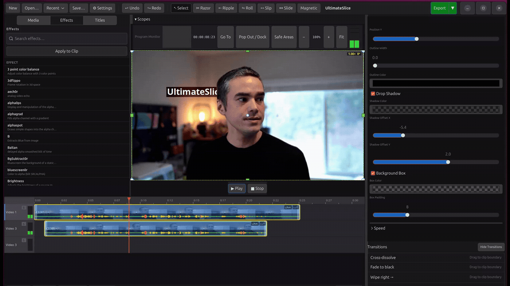

# UltimateSlice


The AI connectable video editor.


**UltimateSlice** is a Final Cut Pro–inspired non-linear video editor built with **Rust** and **GTK4**, powered by **GStreamer** for media playback and export.

Built in MCP server allows for AI collaboration.

## Features

### ✅ Implemented
- GTK4 application scaffold with dark theme styling
- Media library import with duration probing (video/audio/image)
- Source monitor with playback, scrubber, in/out marks, and timecode
- Timeline with multi-track rows, zoom/pan, clip selection, trim, move, razor
- Undo/Redo command history
- Inspector panel for selected clip properties
- MP4/H.264 export via GStreamer pipeline
- FCPXML 1.10–1.14 import + 1.14 export
- Optional MCP server (`--mcp`) for JSON-RPC control

## Third-Party Crates and Libraries

UltimateSlice uses open-source crates and runtime libraries, including:

- `gtk4-rs` / `gdk4` / `gio` / `glib` — LGPL-2.1-or-later
- `gstreamer-rs` + GStreamer — LGPL-2.1-or-later
- `quick-xml` — MIT
- `serde` / `serde_json` — MIT OR Apache-2.0
- `uuid` — MIT OR Apache-2.0
- `anyhow` / `thiserror` / `log` / `env_logger` — MIT OR Apache-2.0
- `rustfft` — MIT OR Apache-2.0
- `ort` (ONNX Runtime) / `ndarray` — MIT OR Apache-2.0
- `resvg` / `usvg` / `tiny-skia` — MIT OR Apache-2.0
- `tempfile` — MIT OR Apache-2.0
- FFmpeg (tooling/runtime) — LGPL-2.1-or-later (Flatpak build enables GPL options)
- x264 (Flatpak build dependency) — GPL-2.0-or-later

For exact versions and full dependency tree, see `Cargo.toml`, `Cargo.lock`, and `io.github.kmwallio.ultimateslice.yml`.



### 🔜 Planned
See `ROADMAP.md` for upcoming features like thumbnails, audio waveforms, multi-track editing, transitions, and a program monitor.

## Project Structure

See `docs/ARCHITECTURE.md` for the full layout and design notes. Highlights:

- `src/app.rs` – GTK application setup and CSS loading
- `src/model/` – core data model (`Project`, `Track`, `Clip`, `MediaItem`)
- `src/media/` – playback, thumbnails, and export
- `src/ui/` – GTK widgets (timeline, inspector, media browser, preview)
- `src/fcpxml/` – FCPXML parser/writer

## Requirements

- Rust (edition 2021, via `rustup`)
- GTK4 development libraries
- GStreamer + plugins for playback and export
- `ffmpeg` on `$PATH` (for export)

**Linux (Ubuntu/Debian):**

```bash
sudo apt install \
  libgtk-4-dev \
  libgstreamer1.0-dev \
  libgstreamer-plugins-base1.0-dev \
  gstreamer1.0-plugins-good \
  gstreamer1.0-plugins-bad \
  gstreamer1.0-libav \
  ffmpeg
```

**macOS ([Homebrew](https://brew.sh)):**

```bash
brew install gtk4 gstreamer gst-plugins-base gst-plugins-good gst-plugins-bad gst-libav ffmpeg
```

Then add to your shell profile so cargo can locate the libraries:

```bash
export PKG_CONFIG_PATH="$(brew --prefix)/lib/pkgconfig:$(brew --prefix)/share/pkgconfig"
```

## Recommended System Specs

Three tiers targeting up to 4K source media, each with suggested UltimateSlice preference settings.

### Minimum (1080p editing, basic 4K with proxies)

| Component | Spec |
|-----------|------|
| CPU | Dual-core, 2.0 GHz+ |
| RAM | 4 GB |
| GPU | Integrated graphics (Intel HD / AMD APU), 512 MB shared VRAM |
| Storage | HDD (SSD recommended for proxy cache) |

**Settings:** Proxy Mode → Half or Quarter, Preview Quality → Quarter, Hardware Acceleration → Off, GSK Renderer → Cairo, Playback Priority → Smooth

### Recommended (4K editing)

| Component | Spec |
|-----------|------|
| CPU | Quad-core, 3.0 GHz+ |
| RAM | 8 GB |
| GPU | Integrated or discrete with VA-API support, 2 GB VRAM |
| Storage | SSD |

**Settings:** Proxy Mode → Off, Preview Quality → Half or Auto, Hardware Acceleration → On, GSK Renderer → Auto (OpenGL), Playback Priority → Balanced

### Ideal (4K real-time, multi-track compositing)

| Component | Spec |
|-----------|------|
| CPU | 6+ cores, 3.5 GHz+ |
| RAM | 16 GB+ |
| GPU | Discrete GPU with VA-API, 4 GB+ VRAM |
| Storage | NVMe SSD |

**Settings:** Proxy Mode → Off, Preview Quality → Full, Hardware Acceleration → On, GSK Renderer → Vulkan, Playback Priority → Accurate, Real-time Preview → On

> **Notes:**
> - VA-API hardware decoding supports H.264, H.265/HEVC, VP9, and AV1.
> - Export uses FFmpeg (CPU-based) — more cores = faster exports.
> - Flatpak includes `--device=dri` for GPU access; native installs need VA-API drivers.

## Build & Run

```/dev/null/bash#L1-5
# from the project root
cargo build
cargo run
```

To run with MCP server enabled:

```/dev/null/bash#L1-3
cargo run -- --mcp
```

To open a project file at startup from program arguments:

```/dev/null/bash#L1-3
cargo run -- /path/to/project.uspxml
```

## Python MCP Socket Client

When using the MCP socket transport (running instance), you can use the Python bridge client:

```/dev/null/bash#L1-2
python3 tools/mcp_socket_client.py
```

Optional socket override:

```/dev/null/bash#L1-2
python3 tools/mcp_socket_client.py --socket /tmp/ultimateslice-mcp.sock
```

The client reads JSON-RPC lines from stdin and writes responses to stdout.
See `docs/user/python-mcp.md` for complete command examples.

## Native Install

After building, run `install.sh` to install the binary, desktop entry, icons, MIME type,
and AppStream metainfo to standard XDG locations:

```bash
# Install to /usr/local (default)
sudo ./install.sh

# Install to /usr (distro-style)
sudo ./install.sh --system

# User-level install (no sudo needed)
./install.sh --prefix=$HOME/.local

# Remove all installed files
sudo ./install.sh --uninstall
```

The script will automatically run `cargo build --release` if the binary is not yet built.
Run `./install.sh --help` for full usage.

## Flatpak

A Flatpak manifest is provided at `io.github.kmwallio.ultimateslice.yml`.

```/dev/null/bash#L1-3
flatpak-builder build-dir io.github.kmwallio.ultimateslice.yml --user --install --force-clean
flatpak run io.github.ultimateslice
```

## Notes

- GTK4 callbacks cannot unwind panics. Avoid `RefCell` double-borrows in UI callbacks.
- The project shares a single GStreamer `playbin` for source and timeline playback.

## License

This project is licensed under the [GNU General Public License v3.0](LICENSE).
