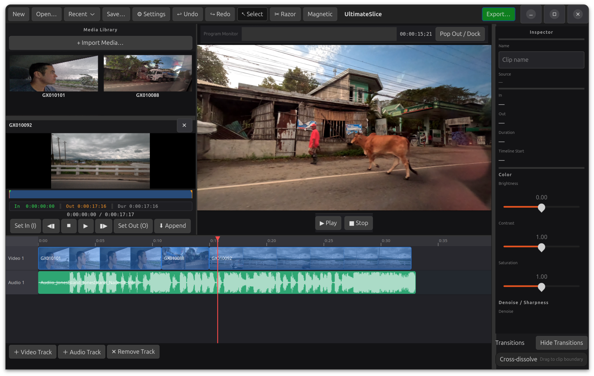

# UltimateSlice

The AI connectable video editor.



**UltimateSlice** is a Final Cut Pro–inspired non-linear video editor built with **Rust** and **GTK4**, powered by **GStreamer** for media playback and export.

Built in MCP server allows for AI collaboration.

## Features

### ✅ Implemented
- GTK4 application scaffold with dark theme styling
- Media library import with duration probing (video/audio/image)
- Source monitor with playback, scrubber, in/out marks, and timecode
- Timeline with multi-track rows, zoom/pan, clip selection, trim, move, razor
- Undo/Redo command history
- Inspector panel for selected clip properties
- MP4/H.264 export via GStreamer pipeline
- FCPXML 1.10 import/export
- Optional MCP server (`--mcp`) for JSON-RPC control

## Third-Party Crates and Libraries

UltimateSlice uses open-source crates and runtime libraries, including:

- `gtk4-rs` / `gdk4` / `gio` / `glib` — LGPL-2.1-or-later
- `gstreamer-rs` + GStreamer — LGPL-2.1-or-later
- `quick-xml` — MIT
- `serde` / `serde_json` — MIT OR Apache-2.0
- `uuid` — MIT OR Apache-2.0
- `anyhow` / `thiserror` / `log` / `env_logger` — MIT OR Apache-2.0
- FFmpeg (tooling/runtime) — LGPL-2.1-or-later (Flatpak build enables GPL options)
- x264 (Flatpak build dependency) — GPL-2.0-or-later

For exact versions and full dependency tree, see `Cargo.toml`, `Cargo.lock`, and `io.github.kmwallio.ultimateslice.yml`.

### 🔜 Planned
See `ROADMAP.md` for upcoming features like thumbnails, audio waveforms, multi-track editing, transitions, and a program monitor.

## Project Structure

See `docs/ARCHITECTURE.md` for the full layout and design notes. Highlights:

- `src/app.rs` – GTK application setup and CSS loading
- `src/model/` – core data model (`Project`, `Track`, `Clip`, `MediaItem`)
- `src/media/` – playback, thumbnails, and export
- `src/ui/` – GTK widgets (timeline, inspector, media browser, preview)
- `src/fcpxml/` – FCPXML parser/writer

## Requirements

- Rust (edition 2021)
- GTK4 development libraries
- GStreamer + plugins for playback and export

On Linux, install GTK4 and GStreamer via your distribution packages.

## Build & Run

```/dev/null/bash#L1-5
# from the project root
cargo build
cargo run
```

To run with MCP server enabled:

```/dev/null/bash#L1-3
cargo run -- --mcp
```

## Python MCP Socket Client

When using the MCP socket transport (running instance), you can use the Python bridge client:

```/dev/null/bash#L1-2
python3 tools/mcp_socket_client.py
```

Optional socket override:

```/dev/null/bash#L1-2
python3 tools/mcp_socket_client.py --socket /tmp/ultimateslice-mcp.sock
```

The client reads JSON-RPC lines from stdin and writes responses to stdout.
See `docs/user/python-mcp.md` for complete command examples.

## Flatpak

A Flatpak manifest is provided at `io.github.kmwallio.ultimateslice.yml`.

```/dev/null/bash#L1-3
flatpak-builder build-dir io.github.kmwallio.ultimateslice.yml --user --install --force-clean
flatpak run io.github.ultimateslice
```

## Notes

- GTK4 callbacks cannot unwind panics. Avoid `RefCell` double-borrows in UI callbacks.
- The project shares a single GStreamer `playbin` for source and timeline playback.

## License

This project is licensed under the [GNU General Public License v3.0](LICENSE).
